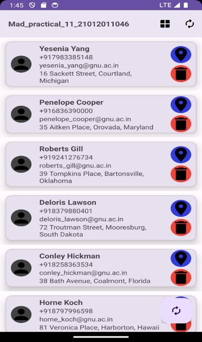
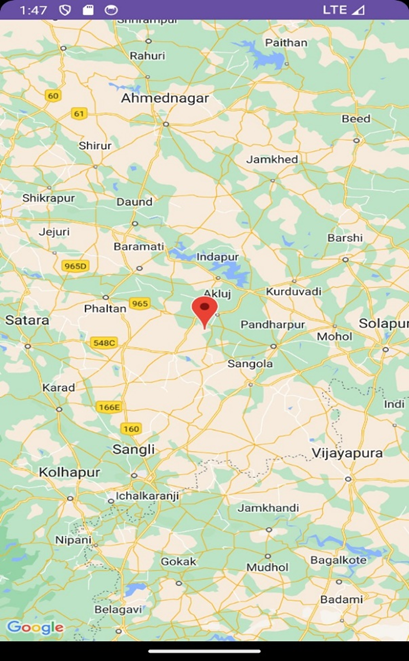
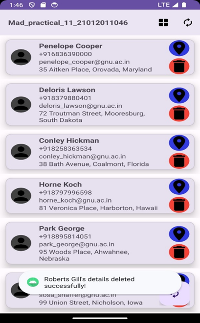

# Practical 11 -Android SQLite and JSON Data Retrieval App

- Submitted By: MAKWANA SWASTIK PRAVIN
- Enrollment number: 21012011046
## Overview

This Android application demonstrates how to create an app that fetches data from a JSON source, stores it in a SQLite database, and displays it in a RecyclerView. The application is designed to perform the following tasks:

- Fetch JSON data from a remote server.
- Store the received JSON data in a SQLite database.
- Display the stored data in a RecyclerView.
- View details and location of a person on Google Maps.
- Delete a person's details from the database.

## Features

1. **MainActivity**: This is the main activity of the application. It consists of a toolbar with two menu buttons and a FloatingActionButton to trigger data retrieval from the JSON source. The two menu buttons perform the following actions:
   - Button 1: Placeholder action (can be customized).
   - Button 2: Retrieve data from the SQLite database and display it in the RecyclerView.

2. **DatabaseHelper.kt**: This class provides functions to create and manage the SQLite database. It includes methods for inserting, deleting, and retrieving data.

3. **HttpRequest.kt**: This class handles HTTP requests to fetch JSON data from a remote server.

4. **Person.kt**: A data class representing a person, with fields such as name, email, phone, address, latitude, and longitude. It also includes a constructor to create a `Person` object from a JSON object.

5. **PersonAdapter.kt**: An adapter class for populating data in the RecyclerView and handling interactions such as viewing a person's location on Google Maps and deleting a person's details.

6. **MapsActivity.kt**: An activity that displays a person's location on Google Maps using the latitude and longitude data stored in the SQLite database.

## Files Link

   - [DatabaseHelper.kt](app/src/main/java/com/swastik/mad_practical_11_21012011046/DatabaseHelper.kt)
   - [HttpRequest.kt](app/src/main/java/com/swastik/mad_practical_11_21012011046/HttpRequest.kt)
   - [MainActivity.kt](app/src/main/java/com/swastik/mad_practical_11_21012011046/MainActivity.kt)
   - [MapsActivity.kt](app/src/main/java/com/swastik/mad_practical_11_21012011046/MapsActivity.kt)
   - [Person.kt](app/src/main/java/com/swastik/mad_practical_11_21012011046/Person.kt)
   - [PersonAdapter.kt](app/src/main/java/com/swastik/mad_practical_11_21012011046/PersonAdapter.kt)
   - [activity_main.xml](https://github.com/MakwanaSwastik/P11_21012011046/blob/master/app/src/main/res/layout/activity_main.xml)
   - [activity_maps.xml](https://github.com/MakwanaSwastik/P11_21012011046/blob/master/app/src/main/res/layout/activity_maps.xml)
   - [person_item.xml](https://github.com/MakwanaSwastik/P11_21012011046/blob/master/app/src/main/res/layout/person_item.xml)
   - [main_menu.xml](https://github.com/MakwanaSwastik/P11_21012011046/blob/master/app/src/main/res/menu/main_menu.xml)
     
# ScreenShots

